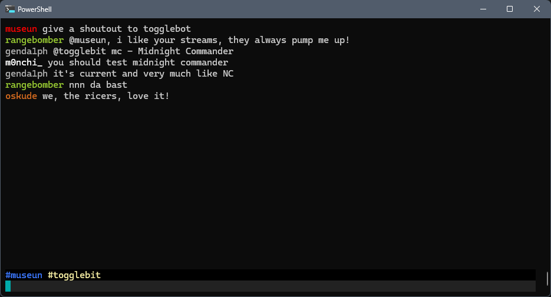

## usage:

ensure: `TWITCH_NAME="your_name_on_twitch"` is set

ensure: `TWITCH_OAUTH="oauth:your_tmi_oauth_token"` is set

run it.

| command                  | action                    |
| ------------------------ | ------------------------- |
| /join #channel           | join a channel            |
| /join channel1,#channel2 | join a series of channels |
| /part #channel           | leave a specific channel  |
| /part                    | leave the current channel |
| /quit                    | disconnect and exit       |
| /reconnect               | force a reconnect         |

---

| key      | action                  |
| -------- | ----------------------- |
| ctrl-1,0 | to change buffers       |
| ctrl-f   | move to next buffer     |
| ctrl-g   | move to previous buffer |

---

screenshot:

license: MIT
